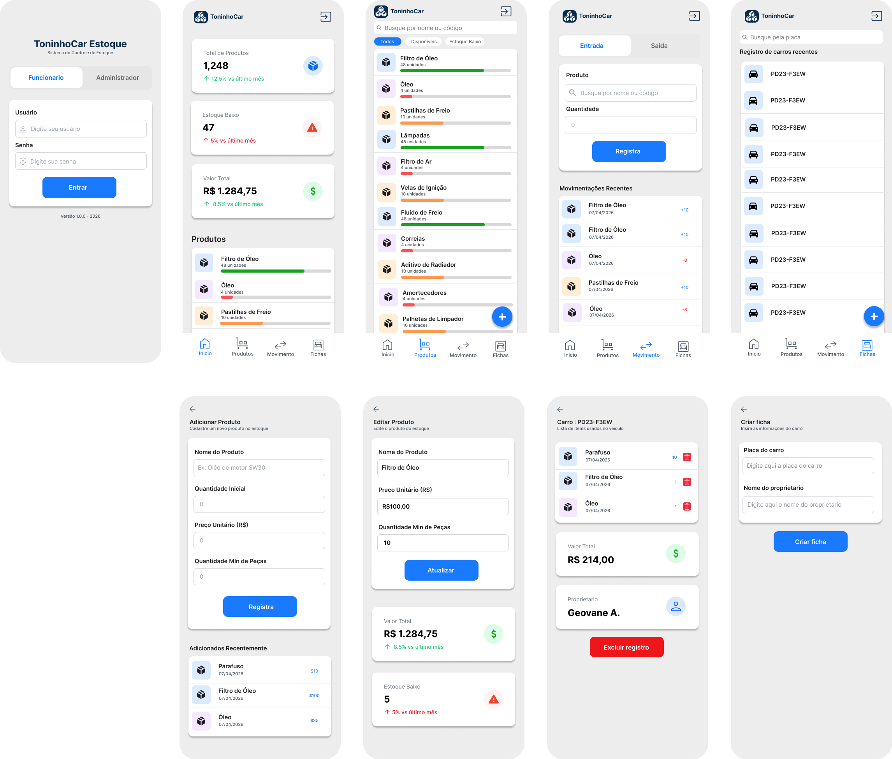

# Projeto de Interface

Pré-requisitos: <a href="02-Especificação do Projeto.md"> Documentação de Especificação</a>

Esta seção apresenta a visão geral da interação do usuário com as telas do sistema **Toninho Car Estoque**, descrevendo o fluxo de navegação, os wireframes e a forma como a interface foi elaborada para atender aos requisitos funcionais, não funcionais e às histórias de usuário definidas na <a href="02-Especificação do Projeto.md">Documentação de Especificação</a>.

A interface foi projetada para uso em **dispositivos móveis**, considerando o contexto real de uma oficina mecânica: telas simples, com poucos toques para concluir cada tarefa, textos legíveis, botões de ação destacados e navegação por abas fixas na parte inferior da tela. Cada perfil de usuário (Administrador e Funcionário) possui um conjunto próprio de telas, garantindo que cada usuário visualize apenas as funções permitidas para sua rotina (RNF-004).

## Diagrama de Fluxo

O diagrama abaixo apresenta o fluxo de navegação do usuário a partir da tela de login. Após a autenticação, o sistema identifica o perfil do usuário e o direciona para a área correspondente: o **Administrador** acessa o conjunto completo de funcionalidades (dashboard, gestão de produtos, movimentações, fichas e relatórios), enquanto o **Funcionário** acessa as funções operacionais (dashboard, consulta de produtos, movimentações de saída e fichas).

## Organização da Navegação por Perfil

### Perfil Administrador (5 abas)

| Aba / Tela | Descrição | Requisitos atendidos |
|---|---|---|
| Dashboard | Cards com total de produtos, itens em estoque baixo e valor total do estoque; prévia da lista de produtos | RF-005, RF-008 |
| Produtos | Listagem com busca por nome/código e filtros (Todos / Disponíveis / Estoque Baixo); acesso ao cadastro, edição e exclusão de produtos e preços | RF-002, RF-003, RF-005 |
| Movimentações | Registro de entrada, saída e baixa de estoque, com busca de produto, quantidade, motivo e histórico recente | RF-004, RF-007 |
| Fichas | Listagem, criação e detalhamento de fichas de veículos, com itens utilizados e valor total do atendimento | RF-006 |
| Relatórios | Relatórios gerenciais com filtros por período e tipo de movimentação, cards de resumo e painel de estoque atual | RF-009 |

### Perfil Funcionário (4 abas)

| Aba / Tela | Descrição | Requisitos atendidos |
|---|---|---|
| Dashboard | Indicadores gerais do estoque, sem acesso às funções de gestão | RF-005 |
| Produtos | Consulta de produtos e quantidade disponível (somente leitura) | RF-005 |
| Movimentações | Registro de saída de produtos utilizados nos serviços | RF-004, RF-007 |
| Fichas | Criação e consulta de fichas dos veículos atendidos | RF-006 |

## Descrição das Principais Telas

- **Login:** campos de e-mail e senha com redirecionamento automático conforme o perfil autenticado (RF-001, RNF-004). É a porta de entrada única da aplicação.
- **Dashboard:** apresenta os indicadores mais importantes do estoque em cards de leitura rápida, atendendo à necessidade de consulta ágil no ambiente de oficina (RNF-002, RNF-006). Produtos com quantidade abaixo do mínimo são destacados visualmente (RF-008).
- **Listagem de Produtos:** busca em tempo real por nome ou código, filtros por situação de estoque e barra visual de nível de estoque por produto (RF-005).
- **Cadastro/Edição de Produto:** formulário com validação de nome, código, quantidade, preço e estoque mínimo; a edição exibe indicadores de valor em estoque e permite exclusão com confirmação (RF-002, RF-003).
- **Movimentações:** seleção do tipo (Entrada/Saída/Baixa) por abas, busca de produto com autocomplete, campo de quantidade com validação contra o estoque disponível e campo de motivo; histórico recente exibido na própria tela (RF-004, RF-007, RNF-005).
- **Fichas do Carro:** criação com placa, modelo, ano, nome do cliente e observações; a tela de detalhes exibe os itens utilizados, o valor total do atendimento e as ações de concluir/excluir a ficha (RF-006).
- **Relatórios:** filtros por período (hoje/semana/mês/todos) e por tipo de movimentação, com cards de resumo e histórico completo (RF-009).

## Wireframes

Os wireframes abaixo apresentam a estrutura das telas da aplicação, elaboradas com base nas histórias de usuário e validadas posteriormente nos testes de usabilidade (ver <a href="11-Registro de Testes de Usabilidade.md">Registro de Testes de Usabilidade</a>).

## Decisões de Interface e Atendimento aos Requisitos

- **Navegação por abas inferiores:** reduz o número de toques e mantém as funções principais sempre visíveis, atendendo ao RNF-002 (interface simples e adequada ao ambiente de oficina).
- **Separação visual por perfil:** o funcionário não visualiza as abas de gestão (adicionar/editar produto, relatórios), reforçando o controle de acesso do RNF-004.
- **Tipografia e contraste:** textos e valores numéricos em tamanho legível em telas de celular, atendendo ao RNF-006.
- **Validações nos formulários:** os formulários impedem o envio de dados incompletos ou inválidos (ex.: saída maior que o estoque disponível), apoiando o RNF-005 (consistência dos dados).
- **Feedback visual:** badges coloridos por tipo de movimentação (entrada/saída/baixa) e alertas de estoque baixo destacados, facilitando a leitura rápida das informações.

As melhorias de interface identificadas nos testes (maior destaque dos botões de ação, reforço do estado ativo na tela de movimentações e texto de apoio no campo de quantidade mínima) estão registradas nos documentos <a href="09-Registro de Testes de Software.md">Registro de Testes de Software</a> e <a href="11-Registro de Testes de Usabilidade.md">Registro de Testes de Usabilidade</a> e fazem parte do plano de evolução da aplicação.
